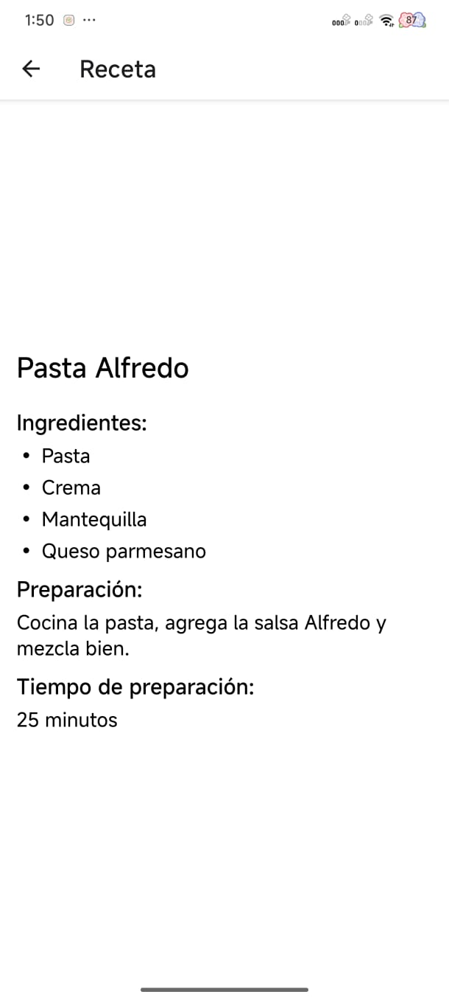
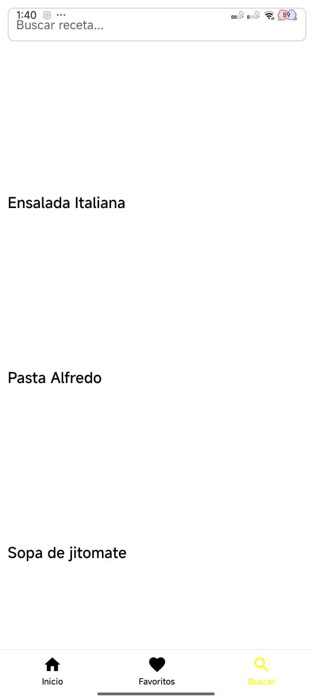

# Resetario - App de Recetas de Cocina

## 1. Identificación del Proyecto

- **Nombre de la App:** Resetario
- **Asignatura/Profesor:** Desarrollo de Aplicaciones Móviles / M.C. Leonel González Vidales
- **Periodo/Fecha:** Septiembre 2025
- **URL del Repositorio:** https://github.com/l3onet/resetario

## 2. Propósito y Alcance del README

Esta aplicación móvil permite explorar y gestionar recetas de cocina mediante una interfaz intuitiva con navegación por pestañas. La app incluye funcionalidades para ver recetas, buscar por nombre, marcar favoritos y ver detalles completos de cada receta. Este README cubre la **configuración del proyecto** y las **dependencias necesarias** para el sistema de navegación y funcionalidades básicas.

## 3. Prerrequisitos y Versiones

### Herramientas Requeridas:

- **Sistema Operativo:** macOS 12+, Windows 10+ o Ubuntu 18.04+
- **Node.js:** v18.17.0 o superior
  ```bash
  node --version
  ```
- **Yarn:** v1.22.19 o NPM 9.0.0+
  ```bash
  yarn --version
  # o
  npm --version
  ```
- **Expo CLI:** v6.3.0+
  ```bash
  npx expo --version
  ```
- **Android Studio:** v2022.3+ con Android SDK 33+ **o** Expo Go app en dispositivo físico
  ```bash
  # Verificar Android SDK
  adb --version
  ```

### Verificación de Entorno:
```bash
npx expo doctor
```

## 4. Estructura del Proyecto

### Estructura Actual del Proyecto:
```
resetario/
├── App.js                          # Componente principal de la aplicación
├── app.json                        # Configuración de Expo
├── package.json                    # Dependencias y scripts del proyecto
├── babel.config.js                 # Configuración de Babel
├── metro.config.js                 # Configuración de Metro bundler
├── tailwind.config.js              # Configuración de Tailwind CSS
├── global.css                      # Estilos globales
├── nativewind-env.d.ts            # Tipos para NativeWind
├── tsconfig.json                   # Configuración de TypeScript
├── index.js                        # Punto de entrada de la aplicación
├── assets/                         # Recursos estáticos
│   ├── adaptive-icon.png
│   ├── favicon.png
│   ├── icon.png
│   └── splash-icon.png
├── components/                     # Componentes reutilizables
│   └── ui/
│       └── gluestack-ui-provider/
└── src/                           # Código fuente principal
    ├── navigations/               # Configuración de navegación
    │   ├── index.js
    │   ├── RootNavigation.js      # Navegación principal (Stack)
    │   └── BottomTabNavigation/   # Navegación por pestañas
    │       ├── index.js
    │       └── BottomTabNavigation.js
    ├── screens/                   # Pantallas de la aplicación
    │   ├── Home/                  # Pantalla principal
    │   ├── Favorites/             # Pantalla de favoritos
    │   ├── Search/                # Pantalla de búsqueda
    │   └── RecipeDetail/          # Pantalla de detalles de receta
    └── utils/                     # Utilidades y datos
        └── recipes.js             # Datos de recetas
```

### Funcionalidades Implementadas:
- **Navegación por pestañas:** Inicio, Favoritos y Buscar
- **Navegación Stack:** Para mostrar detalles de recetas
- **Gestión de recetas:** Visualización, búsqueda y favoritos
- **Interfaz moderna:** Con iconos y navegación intuitiva

## 5. Dependencias Base y su Propósito

### Dependencias de Navegación:
```bash
npm install @react-navigation/native@^7.1.17 @react-navigation/native-stack@^7.3.26 @react-navigation/bottom-tabs@^7.3.26
npx expo install react-native-screens@~4.16.0 react-native-safe-area-context@~5.6.0
npx expo install @expo/vector-icons
```

### Tabla de Dependencias:

| Dependencia | Versión | Propósito |
|-------------|---------|-----------|
| `@react-navigation/native` | ^7.1.17 | Core de navegación entre pantallas, manejo de estado de navegación |
| `@react-navigation/native-stack` | ^7.3.26 | Stack navigator para navegación jerárquica (Lista → Detalles) |
| `@react-navigation/bottom-tabs` | ^7.3.26 | Tab navigator para navegación por pestañas (Inicio, Favoritos, Buscar) |
| `react-native-screens` | ~4.16.0 | Optimización de rendimiento para transiciones nativas |
| `react-native-safe-area-context` | ~5.6.0 | Manejo de áreas seguras (notch, barras de estado) |
| `@expo/vector-icons` | ~15.0.0 | Iconos para la interfaz de usuario |
| `expo-status-bar` | ~3.0.8 | Control de apariencia de barra de estado (incluida por defecto) |

### Verificar instalación:
```bash
npm list --depth=0
```

## 6. Scripts de Ejecución y Build

### Scripts Disponibles en package.json:
```bash
# Iniciar servidor de desarrollo
npm start
# o
npx expo start

# Ejecutar en Android (emulador/dispositivo)
npm run android
# o
npx expo start --android

# Ejecutar en iOS (solo macOS)
npm run ios
# o  
npx expo start --ios

# Ejecutar en web
npm run web
# o
npx expo start --web
```

### Comandos Adicionales Útiles:
```bash
# Limpiar cache de Metro
npx expo start --clear

# Verificar configuración del proyecto
npx expo doctor

# Build para producción (requiere EAS)
npx eas build --platform android
npx eas build --platform ios

# Publicar actualización OTA
npx eas update
```

### Notas de Entorno:
- **Emulador Android:** Debe estar iniciado antes de ejecutar `npm run android`
- **Dispositivo físico:** Usar Expo Go y escanear QR code
- **Túnel para redes restrictivas:** `npx expo start --tunnel`

## 7. Navegación y Pantallas

### Estructura de Navegación:
La aplicación utiliza una combinación de **Stack Navigation** y **Bottom Tab Navigation**:

#### Stack Navigation (RootNavigation.js):
- **Main:** Contenedor principal con Bottom Tab Navigation
- **RecipeDetail:** Pantalla de detalles de receta individual

#### Bottom Tab Navigation:
- **Inicio:** Pantalla principal con lista de recetas
- **Favoritos:** Pantalla con recetas marcadas como favoritas
- **Buscar:** Pantalla para buscar recetas por nombre

### Pantallas Implementadas:
1. **HomeScreen:** Muestra la lista principal de recetas
2. **FavoritesScreen:** Gestiona las recetas favoritas del usuario
3. **SearchScreen:** Permite buscar recetas por nombre
4. **RecipeDetailScreen:** Muestra detalles completos de una receta



### Datos de Recetas:
Las recetas están definidas en `src/utils/recipes.js` e incluyen:
- ID único
- Nombre de la receta
- URL de imagen
- Lista de ingredientes
- Instrucciones de preparación
- Tiempo de preparación



## 8. Ejecución en Android/iOS (Expo / Emulador / Físico)

### Opción A: Dispositivo Físico con Expo Go

1. **Instalar Expo Go:**
   - Android: [Google Play Store](https://play.google.com/store/apps/details?id=host.exp.exponent)
   - iOS: [App Store](https://apps.apple.com/app/expo-go/id982107779)

2. **Ejecutar proyecto:**
   ```bash
   npx expo start
   ```

3. **Conectar dispositivo:**
   - **Android:** Escanear QR code con Expo Go
   - **iOS:** Usar cámara para escanear QR code

### Opción B: Emulador Android

1. **Configurar Android Studio:**
   - Crear AVD (Android Virtual Device) con API 33+
   - Iniciar emulador antes de ejecutar el proyecto

2. **Ejecutar en emulador:**
   ```bash
   npx expo start --android
   ```

### Nota de Permisos:
- **Android:** Activar "Instalación de fuentes desconocidas" para Expo Go
- **Firewall:** Permitir conexiones en puerto 8081 y 19000-19002

### Problemas Típicos:
- **Puerto ocupado:** `npx expo start --port 8082`
- **ADB no reconoce dispositivo:** `adb kill-server && adb start-server`
- **Metro cache:** `npx expo start --clear`

## 9. Troubleshooting Básico

### Problemas Comunes y Soluciones:

| Problema | Síntoma | Solución |
|----------|---------|----------|
| **Error de instalación NPM** | "npm ERR! peer dep missing" | `npm install --legacy-peer-deps` |
| **SDK Android no encontrado** | "Android SDK not found" | Verificar ANDROID_HOME en variables de entorno |
| **Expo Go no conecta** | QR funciona pero no carga app | Verificar que dispositivo y PC estén en misma red WiFi |
| **Metro bundler falla** | "Metro has encountered an error" | `npx expo start --clear` para limpiar cache |
| **Dependencias desactualizadas** | Warnings en consola | `npx expo doctor` y seguir recomendaciones |

### Comandos de Verificación:
```bash
# Verificar entorno completo
npx expo doctor

# Limpiar cache de Metro
npx expo start --clear

# Reinstalar node_modules
rm -rf node_modules package-lock.json && npm install

# Verificar puertos disponibles
npx expo start --port 8082
```

### Recursos Adicionales:
- [Documentación oficial de Expo](https://docs.expo.dev/)
- [React Navigation Docs](https://reactnavigation.org/docs/getting-started)
- [Troubleshooting Expo](https://docs.expo.dev/troubleshooting/overview/)

---

**Última actualización:** Octubre 05, 2025